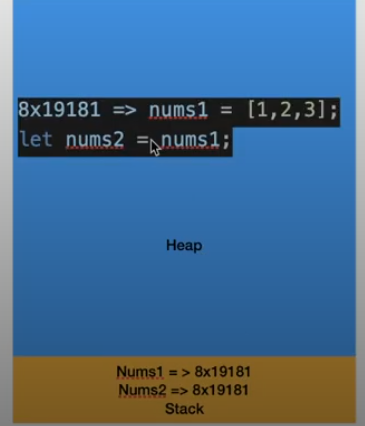
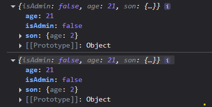
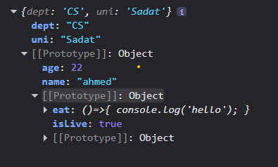
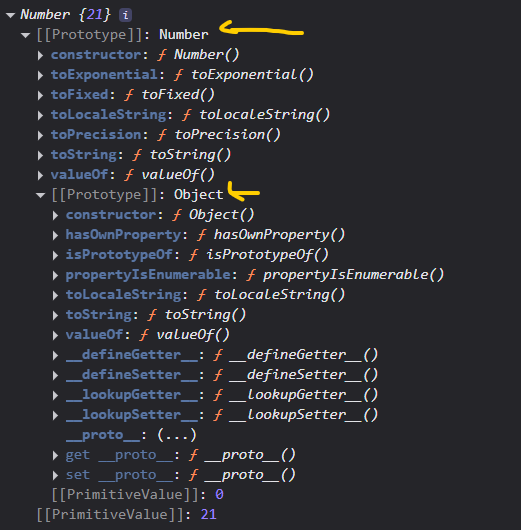

# Strict Mode 
- ES5
## What is Strict 
- A mode that can be added to JavaScript code to help avoid some common errors
```js
function test(){
  x = 100; // global karsa
}
test()
console.log(x); // 100
```
- 2009 es5 strick mode don't allow error 
- how use in top define : 

```js
'use strict';
function test(){
  x = 100; 
}
test()
console.log(x); // x is not defined
```
- another way : 
```js   
function test2(){
'use strict';
  x = 100; 
}
test()
console.log(x); 

```

# Const
- const is a keyword that can be used to declare a constant variable, which means the value of the variable cannot be changed once it is assigned.
```js
const x = 100;
x = 200; // error
```
- const is a block scope variable, which means it is only accessible within the block of code where it is defined.
- const is not hoisted, which means it is not accessible before it is 
```js
function test(){
  const x = 100;
  if(true){
    const x = 200;
    console.log(x); // 200
  }
  console.log(x); // 100
}
```
- **any variable you know it didn't reassign the best practice define const**
- const not change value in code but can change value in execution 
- *EX*
- forOf -> es6 
```js
const friend = ['ahmed' , 'mohamed' ,'salah']
for(const i of friend){
  console.log(i);
}
// this code run and print value because const locate point to const variable not to value
```
- the value can't change through reassignment using the operator 

# let
- let is a keyword that can be used to declare a variable that can be reassigned.
- let is a block scope variable, which means it is only accessible within the block of code where it is defined.

```js
function test(){
    let x = 100;
  if(true){
    let x = 200;
    console.log(x); // 200
  }
  console.log(x); // 100
}
```
- let is not hoisted, which means it is not accessible before it is 
```js
console.log(x);
let x = 10;
console.log(x);
// output : Cannot access 'x' before initialization
```
# Default Parameters

```js
function test (name,age,salary){
  console.log('welcome ' + name + ' your age is ' + age + ' your salary is ' + salary);
}
test('ahmed', 20, 3000);
// welcome ahmed your age is 20 your salary is 3000
test( 'ahmed',29)
// welcome ahmed your age is 29 your salary is undefined
test( 29)
// welcome 29 your age is undefined your salary is undefined
```
- its a moseba
- First Solve this problem use if condition but not optimal
```js
function test (name,age,salary){
    // ternary operator
    name === undefined ? name = 'ahmed' : name ;
    age === undefined ? age = 21 : age;
    salary === undefined ? (salary = 1000) : salary;

  console.log('welcome ' + name + ' your age is ' + age + ' your salary is ' + salary);
}
test('ahmed', 20, 3000);
// welcome ahmed your age is 20 your salary is 3000
test( 'ahmed',29)
// welcome ahmed your age is 29 your salary is 1000
test( 29)
// welcome 29 your age is 21 your salary is 1000
```
- ES6 give default parm
- in function have default parm can't use (use strict)
```js
function test (name = 'ahmed',age = 21,salary = 3200){
  console.log('welcome ' + name + ' your age is ' + age + ' your salary is ' + salary);
}
test('ahmed', 20, 3000);
// welcome ahmed your age is 20 your salary is 3000
test( 'ahmed',29)
// welcome ahmed your age is 29 your salary is 3200
test('ahmed')
// welcome ahmed your age is 21 your salary is 3200
```
# template literals 
- ES6
- it's a way to create string with multi line and variables
- use backtick ` `
- use ${} to insert variables

```js
const name = 'ahmed';
const age = 21;
const salary = 3200;
const message = 'welcome ' + name + ' your age is ' + age + ' your salary is ' + salary;
console.log(message);
// welcome ahmed your age is 21 your salary is 3200
```
- use template literals
```js
const name = 'ahmed';
const age = 21;
const salary = 3200;
const message = `welcome ${name} your age is ${age} your salary is ${salary}`;
```
```js
const name = 'ahmed';
const age = 21;
const salary = 3200;
const message = `welcome ${name} 
your age is ${age} 
your salary is ${salary}`;
console.log(message);
// welcome ahmed
// your age is 21
// your salary is 3200
```

# Spread operator 
- ES6
- it's a way to copy array or object
- use `...`
```js
function getAvg (x=0,y=0,z=0){
  let sum = x + y + z;
  let avg = sum / 4;
  console.log(avg);
}
let nums = [10,20,30,40]
// getAvg(10,20,30,40);
getAvg(...nums);
// 15
```

```js
let schoolFriend = ['ahmed' , 'ali' , 'fakhr']
let allFriend = ['mohamed' , 'shaker']

let spread = [...schoolFriend , ...allFriend]
console.log(spread);
// (5) ['ahmed', 'ali', 'fakhr', 'mohamed', 'shaker']
```
```js
let schoolFriend = ['ahmed' , 'ali' , 'fakhr']
let allFriend = ['mohamed' ,[...schoolFriend], 'shaker']
console.log(allFriend);
/*
 (3) ['mohamed', Array(3), 'shaker']
0: "mohamed"
1: (3) ['ahmed', 'ali', 'fakhr']
2: "shaker"
length: 3 
 */
```

> Rest Parameter 
- spread operator but on param

```js
// function getAvg(...num)
// {
//   console.log(num); // (4) [10, 20, 30, 40]
// }
// getAvg(10,20,30,40)
function getAvg(...nums)
{
  let sum = 0;
  for (const num of nums) {
    sum+=num
  }
  let avg = sum/nums.length
  console.log(avg);
}
getAvg(10,20,30,40,50)
// 30
```

> Spread With Object
```js
let obj1 = {
  name : 'ahmed',
  age : 21
}
let obj2 = {
  gender : 'male',
  salary : 90000
}
let person = {...obj1,...obj2}
console.log(person); // {name: 'ahmed', age: 21, gender: 'male', salary: 90000}
```
- OR 
```js
let obj1 = {
  name : 'ahmed',
  age : 21
}
let obj2 = {
  gender : 'male',
  salary : 90000,
  ...obj1
}
console.log(obj2); // {name: 'ahmed', age: 21, gender: 'male', salary: 90000}
```

# Memory & Deep Copy InterView
## What is Memory 
- Memory is a place where computer stores data
- Memory is divided into two parts : 
  - Stack 
  - Heap 
- Stack : 
  - Stores primitive data types and references (not the object itself) to objects in the heap
- Heap : 
  - Stores the actual objects (reference types)
```js
int x = 10;             // x is stored in Stack
String s = "hello";     // s (reference) is in Stack, the String object "hello" is in Heap
```


> Shallow Copy 
- This name is Shallow Copy : because the reference is copied to another variable
```js
let nums1 = [10,20,30,40]
let nums2 =nums1 ;

nums2.push(50)

console.log(nums1); // (5) [10, 20, 30, 40,50]
console.log(nums2); // (5) [10, 20, 30, 40,50]
// nums1 and nums2 is reference to same memory
```
```js
let obj1 = {
  name : 'ahmed',
  age : 21
}
let obj2=obj1
obj2.name = 'ali';
console.log(obj1); //{name: 'ali', age: 21}
console.log(obj2); // {name: 'ali', age: 21}
```
>Deep Copy
- two arr has two different memory
- using spread operator
```js
let nums1 = [10,20,30,40]
let nums2 =[...nums1] ;
//         [] -> crate new arr 

nums2.push(50)

console.log(nums1); // (4) [10, 20, 30, 40]
console.log(nums2); // (5) [10, 20, 30, 40,50]
```
```js
let obj1 = {
  name : 'ahmed',
  age : 21
}
let obj2={...obj1}
obj2.name = 'ali';
console.log(obj1); //{name: 'ahmed', age: 21}
console.log(obj2); // {name: 'ali', age: 21}
```
- **spread operator not best choice for deep copy Because it work for one level in object**
- if object has object inside not allow

```js
let obj1 = {
  isAdmin : false,
  age : 21,
  son :{
    age : 1
  }
}
let obj2={...obj1}
obj1.son.age = 2;
console.log(obj1);
console.log(obj2);
```


**Solution**
- JSON.parse(JSON.stringify())

```js
let obj1 = {
  isAdmin : false,
  age : 21,
  son :{
    age : 1
  }
}
let obj2 = JSON.parse(JSON.stringify(obj1));
obj1.son.age = 2;
console.log(obj1);
console.log(obj2);
```

- but has error on date datatype

- **use structureClone**
```js
let obj1 = {
  isAdmin : false,
  age : 21,
  son :{
    age : 1
  }
}
let obj2 = structuredClone(obj1)
obj1.son.age = 2;
console.log(obj1);
console.log(obj2);
```

# Destructuring
- it's a way to extract values from arrays or objects and assign them to variables
```js
let  x = ['ahmed' , 'mohamed']
let [y,z] = x 
// y = 'ahmed
// z = mohamed
```

# Map

- Map is a new data structure in ES6
- can make for loop
- same object but enhanced object  
- key , value
- key can be any datatype

```js
let user = {
    name : 'ahmed',
    age : 21 ,
    gender : 'male'
}

let userMap  = new Map() // {}
// create map empty
// userMap.set('key' , 'value')
userMap.set('name' , 'ahmed')
userMap.set('age',21)
userMap.set('gender', 'male');
userMap.set('salary' , 50000)
console.log(userMap);
/*
    {'name' => 'ahmed', 'age' => 21, 'gender' => 'male', 'salary' => 50000}
*/

```
- profit
```js
console.log(userMap.size); // 4 not in obj
// userMap.delete('key')
userMap.delete('age')
console.log(userMap); // Map(3) {'name' => 'ahmed', 'gender' => 'male', 'salary' => 50000}
// has key
console.log(userMap.has('name') ); // true or false
// userMap.clear() to clear map
console.log(userMap.get('salary'));
console.log(userMap.keys());
console.log(userMap.values());
console.log(userMap.entries()); // element

for (const x of userMap) {
    console.log(x); // return entries
}
for (const x of userMap) {
    console.log(x[0]); // return keys
}
for (const x of userMap) {
    console.log(x[1]); // return values
}
/*
    (2) ['name', 'ahmed']
    (2) ['gender', 'male']
    (2) ['salary', 50000]
    return array
*/
```
- using destructing 
```js
for (const [key,value] of userMap) {
    console.log(key , value); 
}
```
-  map can make any datatype of key you want to make key as object available , or func

- convert obj to map
```js
let user = {
    name : 'ahmed',
    age : 21 ,
    gender : 'male'
}
let userMap2 = new Map(Object.entries(user))
console.log(userMap2); // and make all method
```
- convert from map to obj
```js
let obj = Object.fromEntries(userMap)
console.log(obj);
```

# Set
- Set is a collection of unique values
- Set is a built-in object that lets you store unique values of any type, whether primitive values or object references
```js
let prices = new Set()
prices.add(100).add(200).add(100)
console.log(prices); // return unique values
// 100
// 200
// same method map
for (const x of prices) {
    console.log(x);
}
// don't have array method
```
- convert array to set and convert set to array
```js
let arr = [100,100,1001,1001,110,200,200]
let uniqueArr = new Set(arr)
console.log(uniqueArr); // return unique values
// Set(4) {100, 1001, 110, 200}
let arrayUniqueArr = Array.from(uniqueArr)
console.log(arrayUniqueArr); // return unique values
// [100, 1001, 110, 200]
```
- or on one line
```js
let arr =Array.from (new Set([100,100,1001,1001,110,200,200]))
console.log(arr);
// (4) [100, 1001, 110, 200]
```

# this
- this keyword is used to refer to the current object inside an object method
- this => window object
- this => undefined in strict mode
- this => object in method

```js
let person = {
    name : 'ahmed',
    age : 21 ,
    salary : 8000,
    hello:function(){
        console.log(`hi me ${this.name}`); // ahmed
    },
    calcSalary:function(){
        function calcTax(){
          return (this.salary * 10) / 100; // this here return undefined because this this here Dealing with the function outside the scope (in window)
        }
        return this.salary - calcTax()
    }
}
console.log(person.calcSalary()); // NaN
```
- to solve this problem can define a variable and move it
```js
    calcSalary:function(){

        let that = this 

        function calcTax(){
          return (that.salary * 10) / 100; 
        }
        return this.salary - calcTax()
    }
console.log(person.calcSalary()); // 7200
```

- or Arrow Function
# Arrow function
- ES6
```js
// declaration func (hoisting)
function test(userName){
    console.log(`welcome ${userName}`);
}
// expression func (not hoisting)
let welcome = function(userName){
    console.log(`welcome ${userName}`);
}
```
> arrow function
- delete keyword function and add after () arrow =>
```js
let welcome2 = (username)=>{
    console.log(`welcome ${username}`);
}
```
- if func have one return statement can remove return keyword and {}
```js
let welcome3 = (user)=> `welcome ${user}`
```
- Benefit
- arrow func don't create itself (this)
- arrow func don't have it's own this

```js
let person = {
    name : 'ahmed',
    age : 21 ,
    salary : 8000,
    hello:function(){
        console.log(`hi me ${this.name}`); // ahmed
    },
    calcSalary:function(){
        let calcTax = ()=>
        {
            return this.salary * 10 / 100; 
        }
        return this.salary - calcTax()
    }
}
console.log(person.calcSalary()); // 7200
```
# OOP

- simulate reality
- two way (class-based , prototype-based)
- class-based : container contain characteristics and action in system

> OOP Contain 
- Inheritance
- Polymorphism
- Abstraction
- Encapsulation

- but all not js
```js
class Instructor{
  - pseudo code
- characteristics
  name;
  address;
  diploma;
- action
  sendAssignment();
  sendFeedback();
}
let ahmed = new Instructor()
```
- everything can touch it -> object
- class -> template contain characteristics

- js -> prototype-based

## prototype inheritance
- any object in js has property named prototype
- to create inheritance 
> Object.setPrototypeOf(child , parent)
```js
let human = {
    isLive : true,
    eat:()=>{
        console.log('hello');
    }
}
let user = {
    name : 'ahmed',
    age : 22
}
Object.setPrototypeOf(user , human)
console.log(user.isLive); // true
let eng = {
    dept : 'CS',
    uni : 'Sadat'
}
Object.setPrototypeOf(eng , user)
console.log(eng.isLive); // true
```

- anything add in setPrototype(not object or null) without this ignore
- can't create circle inheritance
```js
String;
let str = new String('')
console.log(str);
// str ->inher String ->inher object
Number;
let num = new Number(21)
// num, -> inher Number -> inher Object .
// Object.setPrototypeOf(num,String)
console.log(num);

```



## Constructor & new keyword
**Constructor : Special Method call automatic when create object from class**

- ctor == constructor
- function without ctor
```js
function createUser (name , age , gender , salary){
    let obj = {}
    obj.fullName = name;
    obj.age = age;
    obj.gender = gender ;
    obj.salary = salary;
    return obj;
}
let user = createUser('fakhr' , 21 , 'male' , 8000)
let user2 = createUser('ahmed' , 21 , 'male' , 21000)
console.log(user);
console.log(user2.salary);
```
> Constructor Function
- use this to return in new obj
- create object from function
```js
function User(name , age , gender , salary){
    this.fullname = name;
    this.age = age ;
    this.gender = gender;
    this.salary = salary
}
let user = new User('ahmed' , 21 , 'male' , 21000 )
console.log(user);
```
> new
- create obj
- connect this be object has created
- run object in user 
- return obj to variable name (user)

- you can create function ctor two way
```js
function User(name , age , gender , salary , friends){
    this.fullname = name;
    this.age = age ;
    this.gender = gender;
    this.salary = salary;
    this.friends = friends
    this.welcome2 = function(){
        console.log(`welcome ${this.fullname}`);
    }
}
let user1 = new User('ahmed' , 21 , 'male' , 21000 ,['ibrahim' , 'Adeeb' , 'Saif'] )
let user2 = new User('fakhr' , 21 , 'male' , 21000, ['ibrahim' , 'Medo' , 'hassan'] )
```
- or using prototype (common and true)

```js
User.prototype.welcome = function(){
    console.log(`welcome ${this.fullname}` );
}
user2.welcome()
user1.welcome2()
```
**Different Between create function using this and using prototype**

*This*
- when type this -> create version for any created object all abject has same function
- in memory user1 has function welcome2 and user2 has function welcome2
- not shared for all obj

*Prototype*
- when create function using prototype create one function in memory in one object and all object inheritance this function shared for all objects
- shared for all obj

## Class Syntax
- ES6

```js
class User{
    // can't be use let or var in class
    // class contain methods and in method create anything need it or property
    // by default activate strict mode
    constructor(name , age , gender , salary , friends) {
        this.fullName = name;
        this.age = age
        this.gender = gender 
        this.salary = salary
        this.friends = friends
    }
    // can't create more than one ctor
    // if create class without ctor js create ctor by default
    welcome = ()=>{
        // here can use let or var or .....
        console.log(`welcome ${this.fullName}`);
        // cant access any property only use this
    }
    login(){
        console.log(`login ${this.fullName}`);
    }
}
let user1 = new User('fakhr' , 21 , 'male' , 21000 , ['ahmed' , 'fakhr'])
let user2 = new User('Mo' , 22 , 'male' , 21000, ['ibrahim' , 'Medo' , 'hassan'] )

console.log(user2);
```
- js still prototype-based class is syntax sugar

## Inheritance
- class child extends parent
- keyword super to call ctor parent

```js
class User{

    constructor(Fname , age , gender , salary , friends) {
        this.fullName = Fname;
        this.age = age
        this.gender = gender 
        this.salary = salary
        this.friends = friends
    }
    welcome = ()=>{
        console.log(`welcome ${this.fullName}`);
    }
    login(){
        console.log(`login ${this.fullName}`);
    }
}
class Engineer extends User{
    constructor(Fname , age , gender , salary , friends, dept , uni) {
        super( Fname , age , gender , salary , friends); // call ctor parent
        this.Dept = dept
        this.uni = uni
        // if call super her error call in first before any this
    }
}
let eng1 = new Engineer('fakhr' , 21 , 'male' , 21000 , ['ahmed' , 'fakhr'] , 'CS' , 'Sadat')
console.log(eng1);
console.log(eng1.welcome());
```
## Polymorphism
- override => true in js , overloading false in js

```js
class Engineer extends User{

    constructor(Fname , age , gender , salary , friends, dept , uni) {
        super( Fname , age , gender , salary , friends); // call ctor parent
        this.Dept = dept
        this.uni = uni
        // if call super her error call in first before any this
    }
    // override
    welcome(){
        console.log(`welcome iam a ${this.fullName} eng`);
    }
}
```

## Access Modifiers
- related Encapsulation
- public , private , protected
- is js not have protected
- default public
- to make private before name add #
- private can't access out class
```js
class User{
    #fullname =''; // private
    constructor(Fname , age , gender , salary , friends) {
        this.#fullname = Fname;
        this.age = age
        this.gender = gender 
        this.salary = salary
        this.friends = friends
    }
    welcome(){
        console.log(`welcome ${this.#fullname}`);
    }
    login(){
        console.log(`login ${this.#fullname}`);
    }
}
```
- abstraction don't have direct in js

- js functional programming and oop programming

**When i can say this language in a functional programming**
- assign function to variable 
```js
let x = function(){

}
```
- pass function as parameter to function
```js
function one(two){

}
function two(){

}
```
- function property in object
```js
let x = {
  eat:function(){

  }
}
```
- return function from function