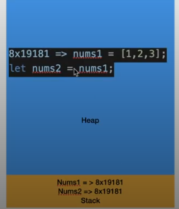
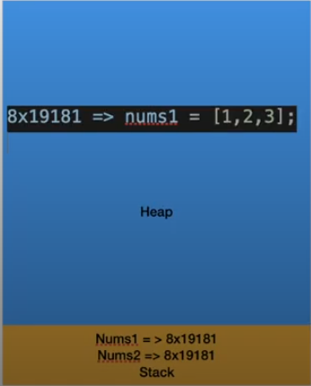
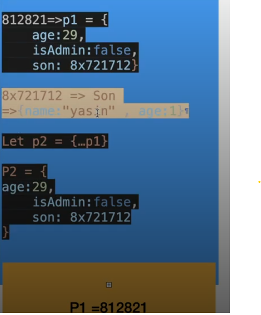
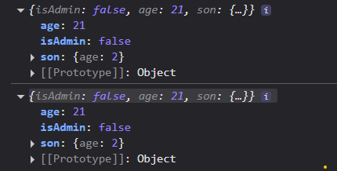
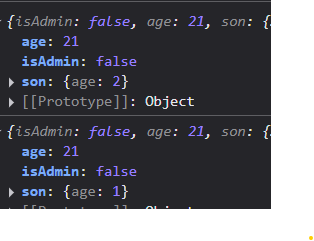

# Strict Mode 

## What is Strict 
- A mode that can be added to JavaScript code to help avoid some common errors
```js
function test(){
  x = 100; // global karsa
}
test()
console.log(x); // 100
```
- 2009 es5 strick mode don't allow error 
- how use in top define : 

```js
'use strict';
function test(){
  x = 100; 
}
test()
console.log(x); // x is not defined
```
- another way : 
```js   
function test2(){
'use strict';
  x = 100; 
}
test()
console.log(x); 

```

# Const
- const is a keyword that can be used to declare a constant variable, which means the value of the variable cannot be changed once it is assigned.
```js
const x = 100;
x = 200; // error
```
- const is a block scope variable, which means it is only accessible within the block of code where it is defined.
- const is not hoisted, which means it is not accessible before it is 
```js
function test(){
  const x = 100;
  if(true){
    const x = 200;
    console.log(x); // 200
  }
  console.log(x); // 100
}
```
- **any variable you know it didn't reassign the best practice define const**
- const not change value in code but can change value in execution 
- *EX*
- forOf -> es6 
```js
const friend = ['ahmed' , 'mohamed' ,'salah']
for(const i of friend){
  console.log(i);
}
// this code run and print value because const locate point to const variable not to value
```
- the value can't change through reassignment using the operator 

# let
- let is a keyword that can be used to declare a variable that can be reassigned.
- let is a block scope variable, which means it is only accessible within the block of code where it is defined.

```js
function test(){
    let x = 100;
  if(true){
    let x = 200;
    console.log(x); // 200
  }
  console.log(x); // 100
}
```
- let is not hoisted, which means it is not accessible before it is 
```js
console.log(x);
let x = 10;
console.log(x);
// output : Cannot access 'x' before initialization
```
# Default Parameters

```js
function test (name,age,salary){
  console.log('welcome ' + name + ' your age is ' + age + ' your salary is ' + salary);
}
test('ahmed', 20, 3000);
// welcome ahmed your age is 20 your salary is 3000
test( 'ahmed',29)
// welcome ahmed your age is 29 your salary is undefined
test( 29)
// welcome 29 your age is undefined your salary is undefined
```
- its a moseba
- First Solve this problem use if condition but not optimal
```js
function test (name,age,salary){
    // ternary operator
    name === undefined ? name = 'ahmed' : name ;
    age === undefined ? age = 21 : age;
    salary === undefined ? (salary = 1000) : salary;

  console.log('welcome ' + name + ' your age is ' + age + ' your salary is ' + salary);
}
test('ahmed', 20, 3000);
// welcome ahmed your age is 20 your salary is 3000
test( 'ahmed',29)
// welcome ahmed your age is 29 your salary is 1000
test( 29)
// welcome 29 your age is 21 your salary is 1000
```
- ES6 give default parm
- in function have default parm can't use (use strict)
```js
function test (name = 'ahmed',age = 21,salary = 3200){
  console.log('welcome ' + name + ' your age is ' + age + ' your salary is ' + salary);
}
test('ahmed', 20, 3000);
// welcome ahmed your age is 20 your salary is 3000
test( 'ahmed',29)
// welcome ahmed your age is 29 your salary is 3200
test('ahmed')
// welcome ahmed your age is 21 your salary is 3200
```
# template literals 
- ES6
- it's a way to create string with multi line and variables
- use backtick ` `
- use ${} to insert variables

```js
const name = 'ahmed';
const age = 21;
const salary = 3200;
const message = 'welcome ' + name + ' your age is ' + age + ' your salary is ' + salary;
console.log(message);
// welcome ahmed your age is 21 your salary is 3200
```
- use template literals
```js
const name = 'ahmed';
const age = 21;
const salary = 3200;
const message = `welcome ${name} your age is ${age} your salary is ${salary}`;
```
```js
const name = 'ahmed';
const age = 21;
const salary = 3200;
const message = `welcome ${name} 
your age is ${age} 
your salary is ${salary}`;
console.log(message);
// welcome ahmed
// your age is 21
// your salary is 3200
```

# Spread operator 
- ES6
- it's a way to copy array or object
- use `...`
```js
function getAvg (x=0,y=0,z=0){
  let sum = x + y + z;
  let avg = sum / 4;
  console.log(avg);
}
let nums = [10,20,30,40]
// getAvg(10,20,30,40);
getAvg(...nums);
// 15
```

```js
let schoolFriend = ['ahmed' , 'ali' , 'fakhr']
let allFriend = ['mohamed' , 'shaker']

let spread = [...schoolFriend , ...allFriend]
console.log(spread);
// (5) ['ahmed', 'ali', 'fakhr', 'mohamed', 'shaker']
```
```js
let schoolFriend = ['ahmed' , 'ali' , 'fakhr']
let allFriend = ['mohamed' ,[...schoolFriend], 'shaker']
console.log(allFriend);
/*
 (3) ['mohamed', Array(3), 'shaker']
0: "mohamed"
1: (3) ['ahmed', 'ali', 'fakhr']
2: "shaker"
length: 3 
 */
```

> Rest Parameter 
- spread operator but on param

```js
// function getAvg(...num)
// {
//   console.log(num); // (4) [10, 20, 30, 40]
// }
// getAvg(10,20,30,40)
function getAvg(...nums)
{
  let sum = 0;
  for (const num of nums) {
    sum+=num
  }
  let avg = sum/nums.length
  console.log(avg);
}
getAvg(10,20,30,40,50)
// 30
```

> Spread With Object
```js
let obj1 = {
  name : 'ahmed',
  age : 21
}
let obj2 = {
  gender : 'male',
  salary : 90000
}
let person = {...obj1,...obj2}
console.log(person); // {name: 'ahmed', age: 21, gender: 'male', salary: 90000}
```
- OR 
```js
let obj1 = {
  name : 'ahmed',
  age : 21
}
let obj2 = {
  gender : 'male',
  salary : 90000,
  ...obj1
}
console.log(obj2); // {name: 'ahmed', age: 21, gender: 'male', salary: 90000}
```

# Memory & Deep Copy InterView
## What is Memory 
- Memory is a place where computer stores data
- Memory is divided into two parts : 
  - Stack 
  - Heap 
- Stack : 
  - Stores primitive data types and references (not the object itself) to objects in the heap
- Heap : 
  - Stores the actual objects (reference types)
```js
int x = 10;             // x is stored in Stack
String s = "hello";     // s (reference) is in Stack, the String object "hello" is in Heap
```


> Shallow Copy 
- This name is Shallow Copy : because the reference is copied to another variable
```js
let nums1 = [10,20,30,40]
let nums2 =nums1 ;

nums2.push(50)

console.log(nums1); // (5) [10, 20, 30, 40,50]
console.log(nums2); // (5) [10, 20, 30, 40,50]
// nums1 and nums2 is reference to same memory
```
```js
let obj1 = {
  name : 'ahmed',
  age : 21
}
let obj2=obj1
obj2.name = 'ali';
console.log(obj1); //{name: 'ali', age: 21}
console.log(obj2); // {name: 'ali', age: 21}
```
>Deep Copy
- two arr has two different memory
- using spread operator
```js
let nums1 = [10,20,30,40]
let nums2 =[...nums1] ;
//         [] -> crate new arr 

nums2.push(50)

console.log(nums1); // (4) [10, 20, 30, 40]
console.log(nums2); // (5) [10, 20, 30, 40,50]
```
```js
let obj1 = {
  name : 'ahmed',
  age : 21
}
let obj2={...obj1}
obj2.name = 'ali';
console.log(obj1); //{name: 'ahmed', age: 21}
console.log(obj2); // {name: 'ali', age: 21}
```
- **spread operator not best choice for deep copy Because it work for one level in object**
- if object has object inside not allow

```js
let obj1 = {
  isAdmin : false,
  age : 21,
  son :{
    age : 1
  }
}
let obj2={...obj1}
obj1.son.age = 2;
console.log(obj1);
console.log(obj2);
```


**Solution**
- JSON.parse(JSON.stringify())

```js
let obj1 = {
  isAdmin : false,
  age : 21,
  son :{
    age : 1
  }
}
let obj2 = JSON.parse(JSON.stringify(obj1));
obj1.son.age = 2;
console.log(obj1);
console.log(obj2);
```

- but has error on date datatype

- **use structureClone**
```js
let obj1 = {
  isAdmin : false,
  age : 21,
  son :{
    age : 1
  }
}
let obj2 = structuredClone(obj1)
obj1.son.age = 2;
console.log(obj1);
console.log(obj2);
```
# Map

- Map is a new data structure in ES6
